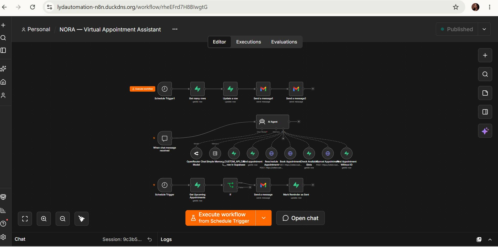
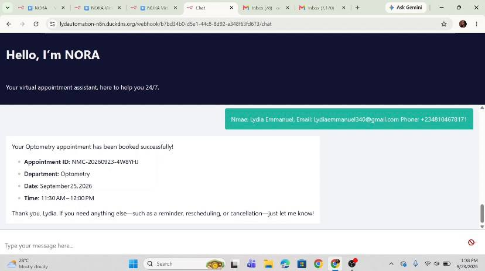
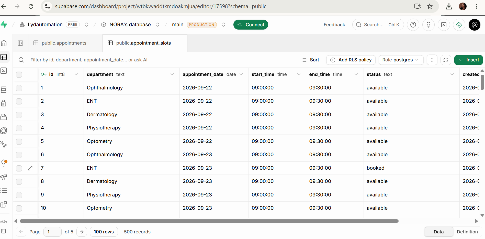
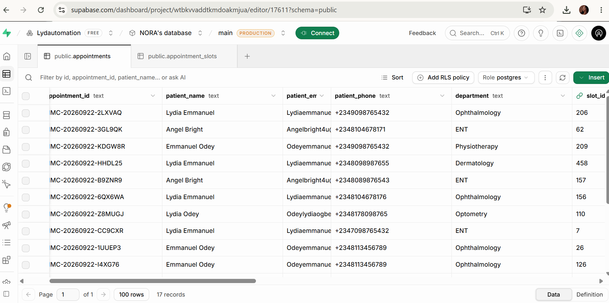
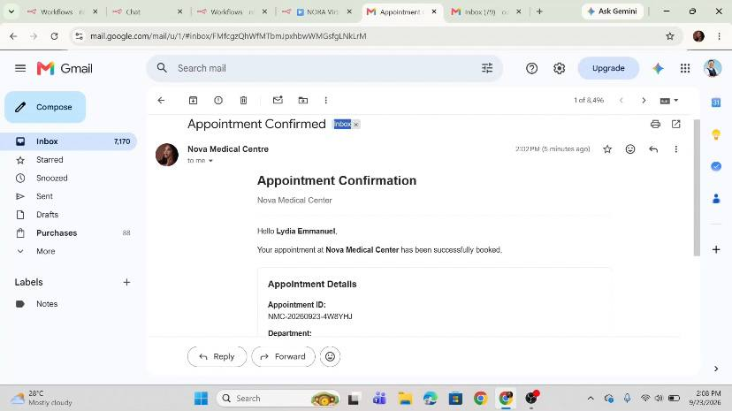
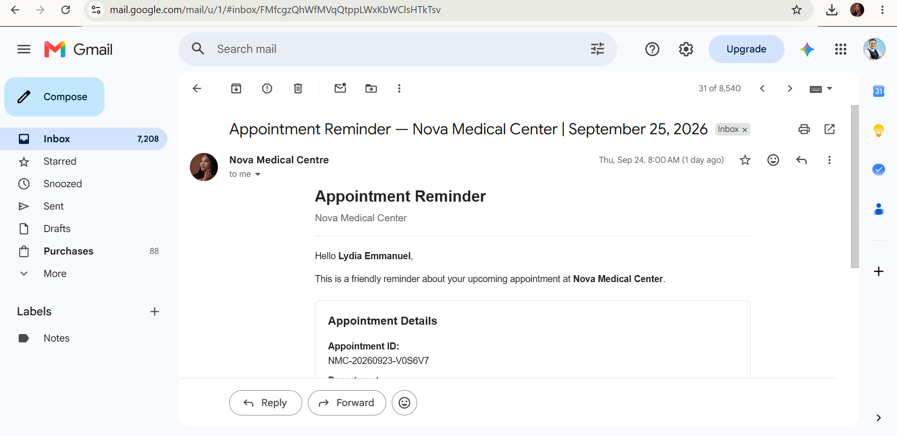

## Project Screenshots

### Workflow Overview

The n8n workflow orchestrates NORA's conversational appointment-management process and connects the AI assistant with the supporting appointment services.

### Patient Interaction

Patients interact with NORA through n8n Web Chat to manage their appointments conversationally.

### Appointment Availability

NORA checks appointment availability against the appointment slots stored in Supabase before presenting available options to the patient.

### Appointment Records

Confirmed appointments are stored and managed in Supabase for subsequent retrieval, rescheduling, and cancellation.

### Appointment Confirmation

After a successful booking, the patient automatically receives an appointment confirmation email.

### 24-Hour Appointment Reminder

NORA automatically sends the patient a reminder 24 hours before the scheduled appointment.

